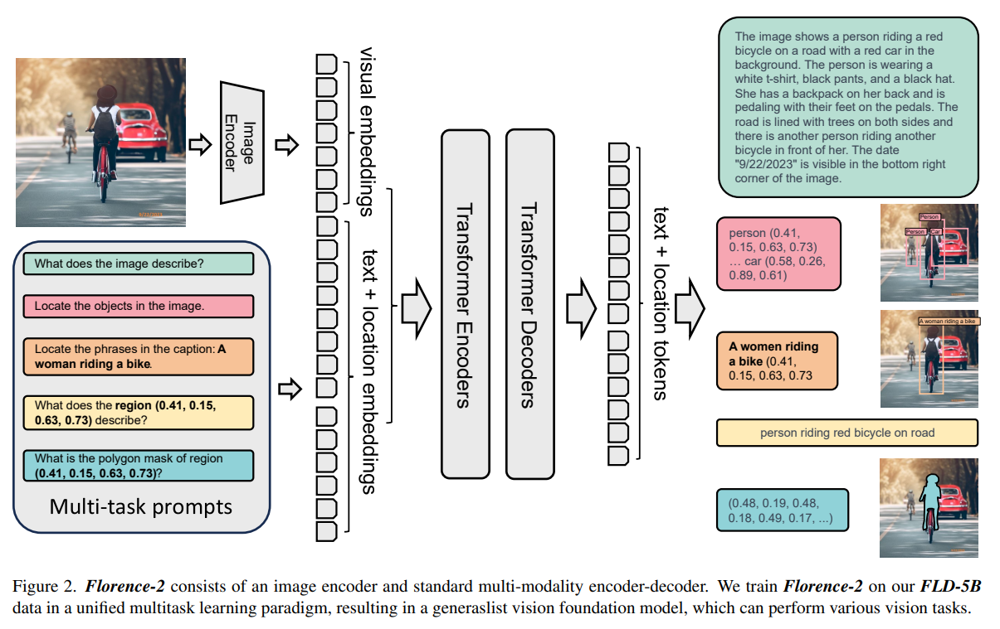
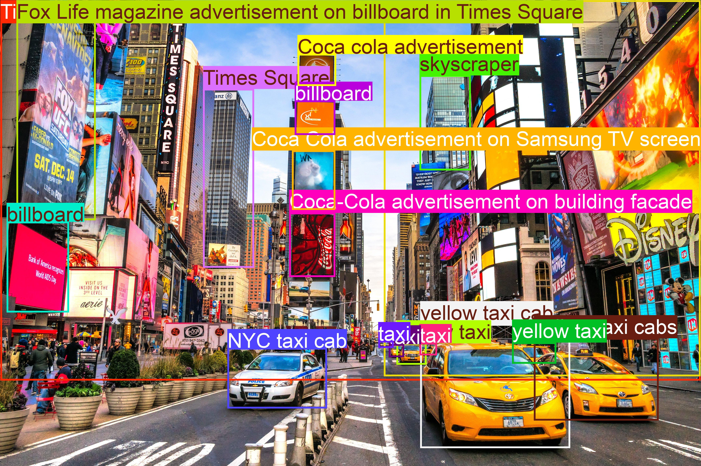
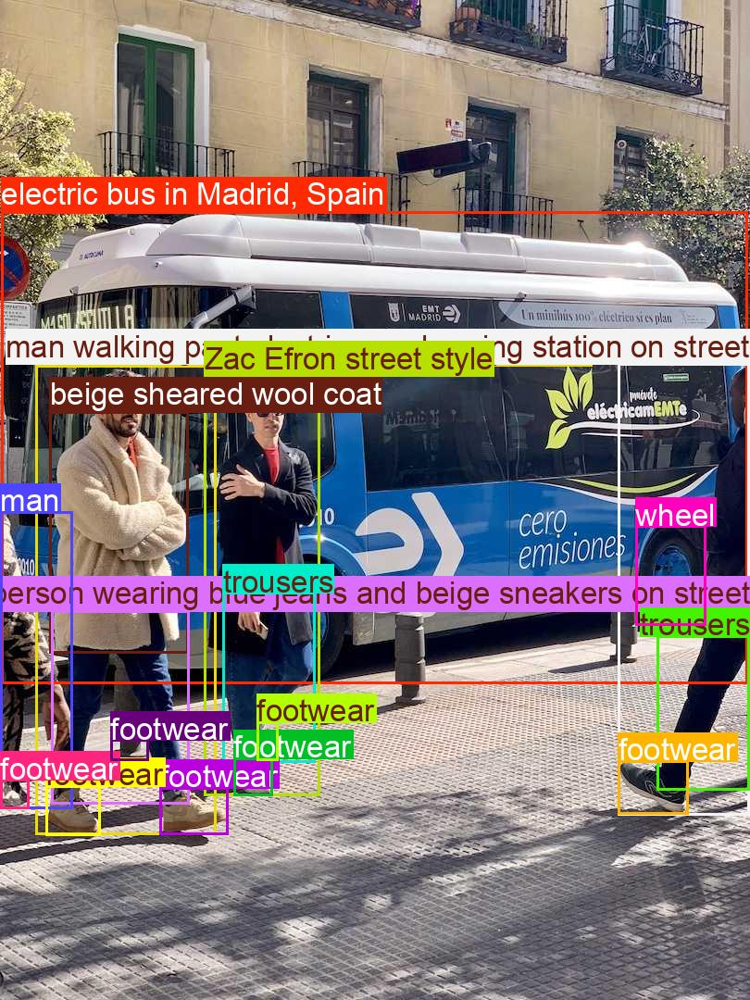
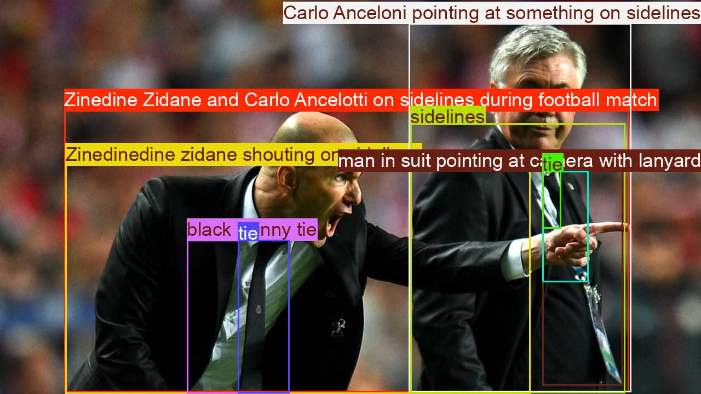

# Image_Captioning_Using_Florence2
Implements Image Captioning using Florence Model from Microsoft.

## What is Florence-2?
Microsoft released the Florence-2 model last year, It is an advanced vision foundation model that uses a prompt-based approach to handle a wide range of vision and vision-language tasks. It can interpret simple text prompts to perform tasks like captioning, object detection, and segmentation.

It leverages the FLD-5B dataset, containing 5.4 billion annotations across 126 million images, to master multi-task learning. The model's sequence-to-sequence architecture enables it to excel in both zero-shot and fine-tuned settings, proving to be a competitive vision foundation model.


[Paper Link](https://arxiv.org/abs/2311.06242)

## Running the Image Captioner

I have created a script called `run.sh` to simplify running the Image Captioner. This script will:

1. Create a Conda environment to avoid interfering with your existing dependencies.
2. Execute the pipeline.
3. Allow you to modify all parameters via terminal arguments using the bash script.

**Example Usage**:
```bash
./run.sh --max-new-tokens 1024 --num-beams 5 --input-image "images/times_square.jpg"
```
## Output Samples

1. Time Square Output Sample:


2. Bus Output Sample:


3. Zidane Output Sample:

